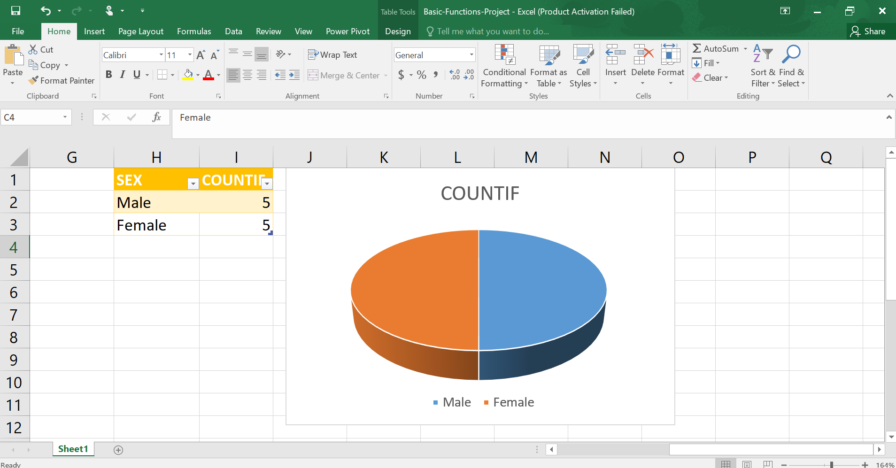
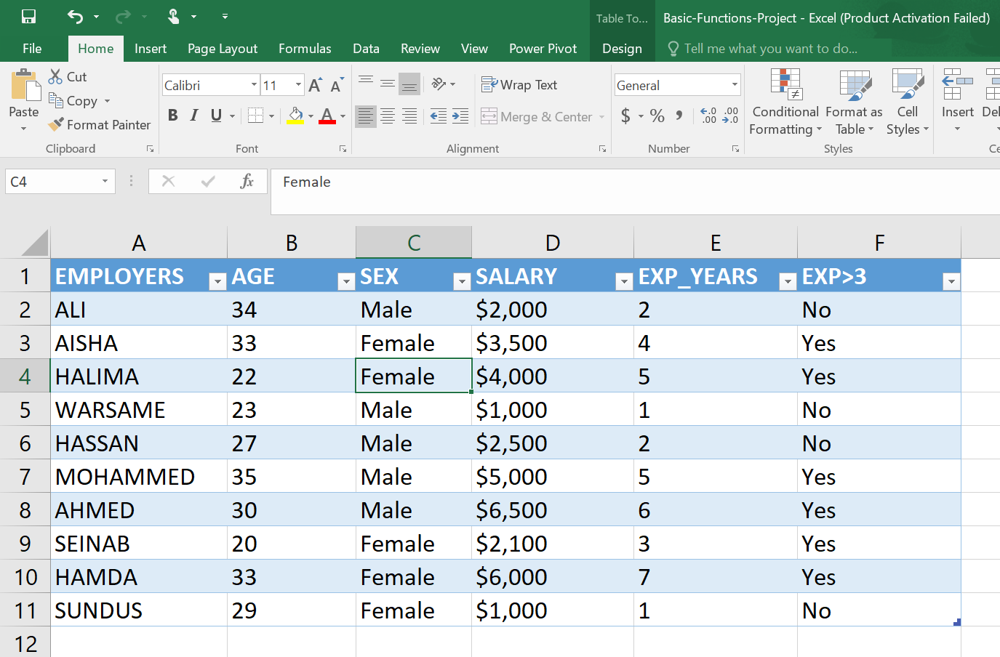
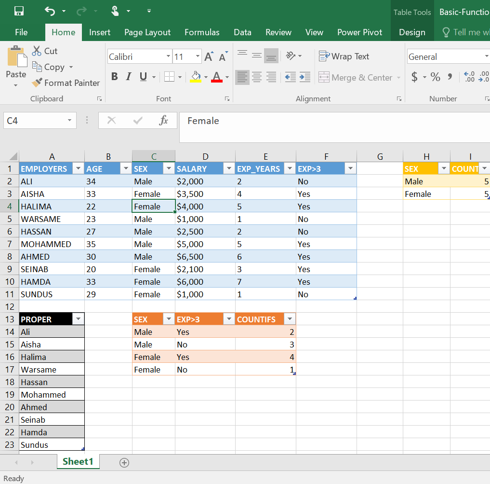
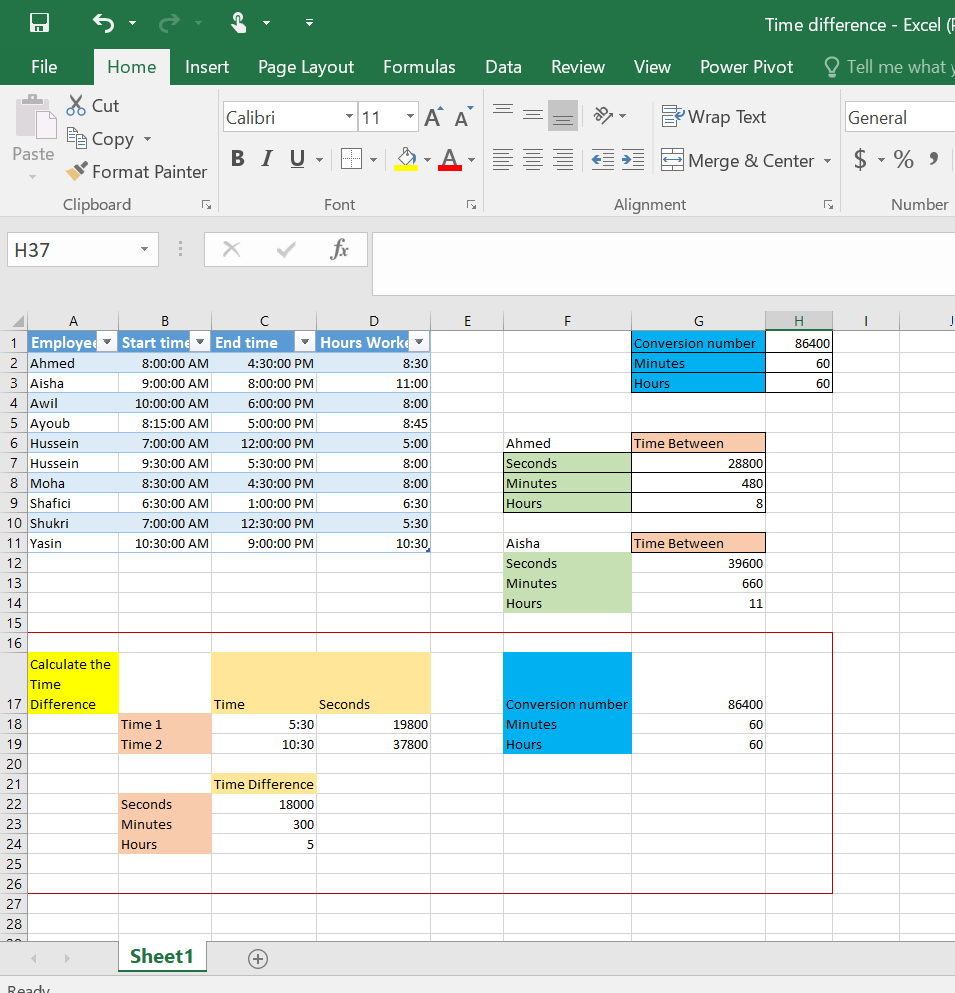

# Basic Excel Functions Project

## 📌 Overview
This project demonstrates my understanding of basic Excel functions using a simple employee dataset.

## 🛠 Functions Used
- PROPER()
- IF()
- COUNTIF()
- COUNTIFS()

## 📊 Skills Practised
- Text cleaning
- Logical functions
- Conditional counting
- Basic spreadsheet formatting
- Creating Excel charts
- Organising datasets

## 📁 Dataset
The dataset includes:
- Employee Name
- Age
- Gender
- Salary
- Experience (Years)

## 📸 Project Preview

### 📈 Final Chart

### 📋 Employee Dataset

### 🧮 Excel Functions

## 📈 What I Learned
- How to clean text using **PROPER()**
- How to use **IF()** for logical conditions
- How to count data using **COUNTIF()** and **COUNTIFS()**
- How to organise employee data in Excel
- How to create a simple chart to visualise data

LESSON 2: Time difference and NPV

Function used:-
- TIME Difference
- NPV

## Preview

## 💰 Net-Present-Value (NPV)
.png)

## ⏰ Time Difference

Created by **Ladan Abdi**
