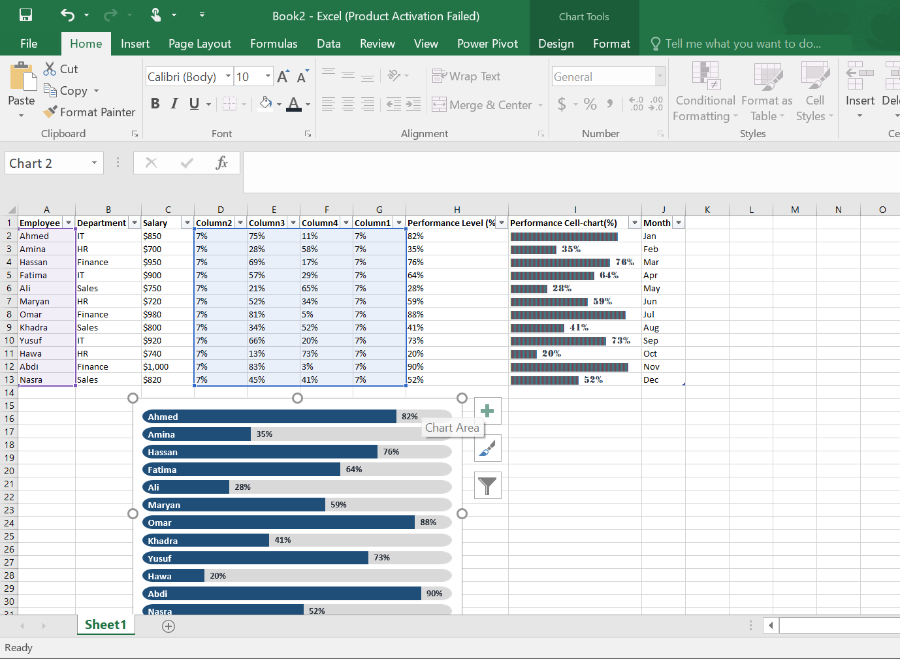
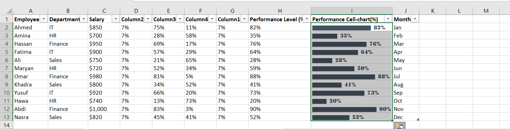

# 📊 Interactive Salary Chart in Microsoft Excel

---

## 📌 Project Overview

This project demonstrates how to create a modern and interactive **Salary Chart** using a **Stacked Column Chart** in Microsoft Excel.

Instead of using a standard column chart, the stacked chart technique is combined with helper columns and custom formatting to produce rounded columns and automatically highlight the employee with the highest salary. The result is a clean and professional visual that is suitable for dashboards and reports.

---

## ✨ Interactive Stacked Chart

The chart is built using a **Stacked Column Chart**, allowing multiple data series to work together to create a unique visual design.

### Preview

---

## 🔄 Dynamic Data Updates

When the salary values are modified, the chart updates automatically and highlights the employee with the highest salary.

### Preview

---

## 🛠️ Tools Used

- Microsoft Excel
- Stacked Column Chart
- Helper Columns
- Conditional Highlighting
- Custom Chart Formatting
---

---

# 📊 Performance Progress Chart

## 📌 Project Overview

This project also includes a **Performance Progress Chart** created in Microsoft Excel using a **Stacked Bar Chart**.

The chart visualises each employee's performance percentage by combining multiple helper columns to create a clean progress-bar effect. Every bar displays the employee's performance level, making it easy to compare results across the entire team.

Unlike a traditional bar chart, this design provides a modern dashboard-style appearance while keeping the information clear and easy to understand.

### ✨ Features

- 📊 Built with a Stacked Bar Chart.
- 📈 Displays employee performance as percentages.
- 🎯 Progress-bar style design using helper columns.
- 📋 Data labels show the exact performance value.
- 💼 Ideal for HR dashboards, KPI reports, and performance tracking.

### Preview

--- 

## 📊 Performance Cell-Chart (%)

This project also includes a **Performance Cell-Chart (%)**, a visual progress indicator created using a **Stacked Bar Chart** and helper columns in Microsoft Excel.

The chart converts each employee's performance percentage into a horizontal progress bar, making it easier to compare individual performance levels at a glance. Each bar displays the exact percentage while the remaining space represents the difference up to 100%, creating a clean and professional KPI-style visual.

To achieve this design, helper columns are used to separate the completed and remaining portions of each progress bar. Custom formatting, colours, and data labels are then applied to produce a modern dashboard appearance.

### ✨ Features

- 📊 Built with a Stacked Bar Chart.
- 📈 Converts percentage values into visual progress bars.
- 🎯 Displays the exact performance percentage for every employee.
- 🎨 Uses helper columns to create the filled and remaining sections.
- 💼 Perfect for KPI dashboards, HR reports, and performance monitoring.

### How It Works

- **Performance Level (%)** stores the original employee performance values.
- **Performance Cell-Chart (%)** transforms those values into a visual progress bar using a stacked chart.
- Helper columns calculate the completed and remaining portions so every bar always represents **100%**.

### Preview

---

## 👤 Created By

**Ladan Abdi**

GitHub: **https://github.com/LD2006-cloud**
