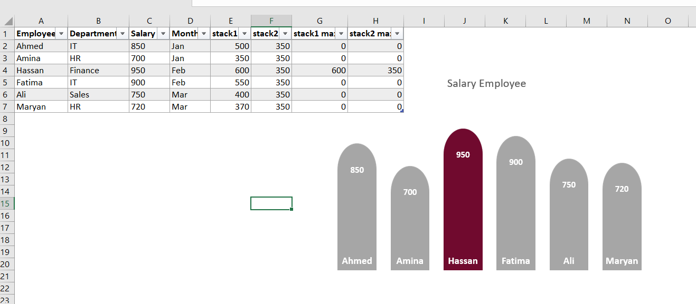
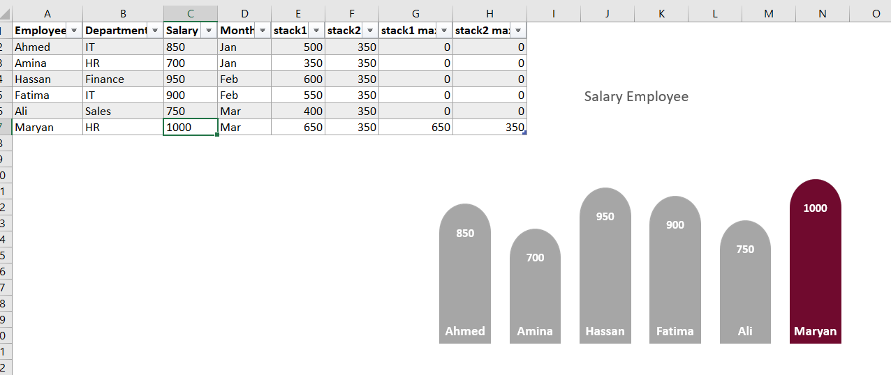

# 📊 Interactive Salary Chart in Microsoft Excel

---

## 📌 Project Overview

This project demonstrates how to create a modern and interactive **Salary Chart** using a **Stacked Column Chart** in Microsoft Excel.

Instead of using a standard column chart, the stacked chart technique is combined with helper columns and custom formatting to produce rounded columns and automatically highlight the employee with the highest salary. The result is a clean and professional visual that is suitable for dashboards and reports.

---

## ✨ Interactive Stacked Chart

The chart is built using a **Stacked Column Chart**, allowing multiple data series to work together to create a unique visual design.

### Preview

---

## 🔄 Dynamic Data Updates

When the salary values are modified, the chart updates automatically and highlights the employee with the highest salary.

### Preview

---

## 🛠️ Tools Used

- Microsoft Excel
- Stacked Column Chart
- Helper Columns
- Conditional Highlighting
- Custom Chart Formatting

---

## 👤 Created By

**Ladan Abdi**

GitHub: **https://github.com/LD2006-cloud**
