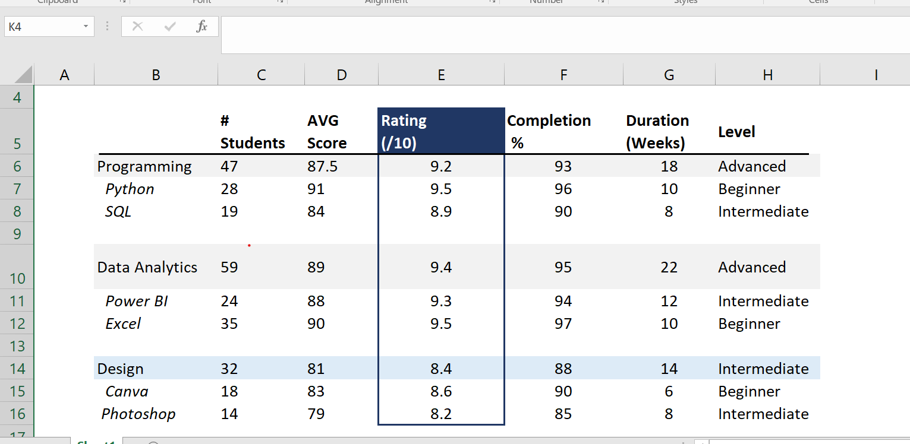
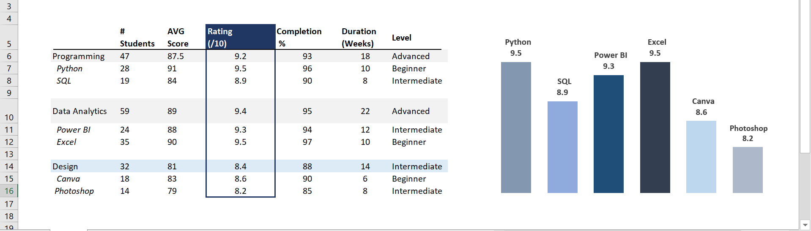

# 📊 Course Rating Analysis in Excel

A simple Excel project that demonstrates how to organise course data into a structured table and create a **Clustered Column Chart** to compare course ratings.

Created by **Ladan Abdi**

---

## 📁 Project Structure

```
Course-Rating-Chart/
│
├── Course-Rating-Chart.xlsx
├── README.md
└── images/
    ├── Dataset.png
    └── Rating-Chart.png
```

---

## 📋 Dataset Overview

The dataset contains information about different learning courses grouped into three categories:

- Programming
- Data Analytics
- Design

Each course includes the following information:

| Column | Description |
|---------|-------------|
| Course | Course or skill name |
| # Students | Number of enrolled students |
| AVG Score | Average student score |
| Rating (/10) | Course rating out of 10 |
| Completion % | Course completion percentage |
| Duration (Weeks) | Course duration in weeks |
| Level | Course difficulty level |

### Dataset Preview



---

## 📊 Column Chart

The project includes a **Clustered Column Chart** created from the **Rating (/10)** column.

The chart compares the ratings of:

- Python
- SQL
- Power BI
- Excel
- Canva
- Photoshop

This makes it easy to identify the highest and lowest rated courses at a glance.

### Chart Preview



---

## 📈 Key Insights

- Python and Excel have the highest rating (**9.5/10**).
- Power BI follows closely with **9.3/10**.
- SQL received **8.9/10**.
- Canva scored **8.6/10**.
- Photoshop has the lowest rating (**8.2/10**).

---

## 🛠 Skills Practised

- Creating structured Excel tables
- Organising datasets
- Formatting tables
- Creating a Clustered Column Chart
- Comparing values using data visualisation
- Presenting data clearly in Excel

---

## 📌 Tools Used

- Microsoft Excel

---

## 👩‍💻 Created By

**Ladan Abdi**
