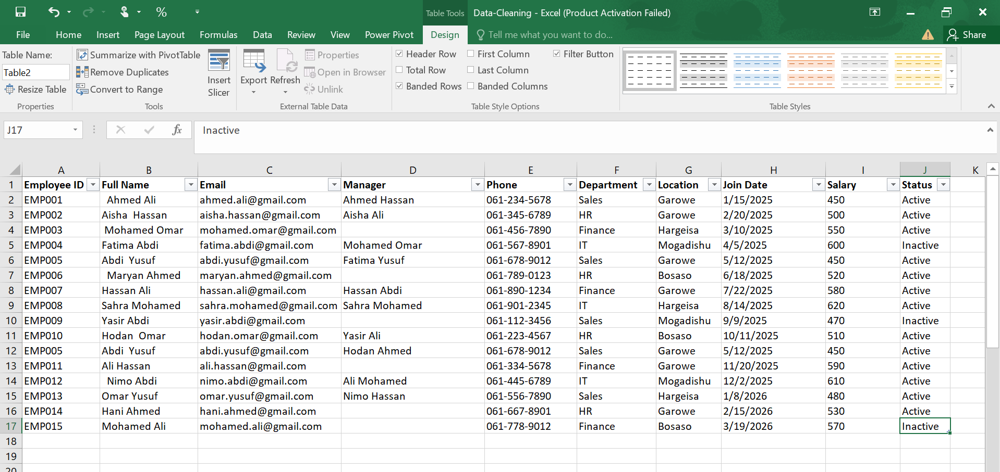
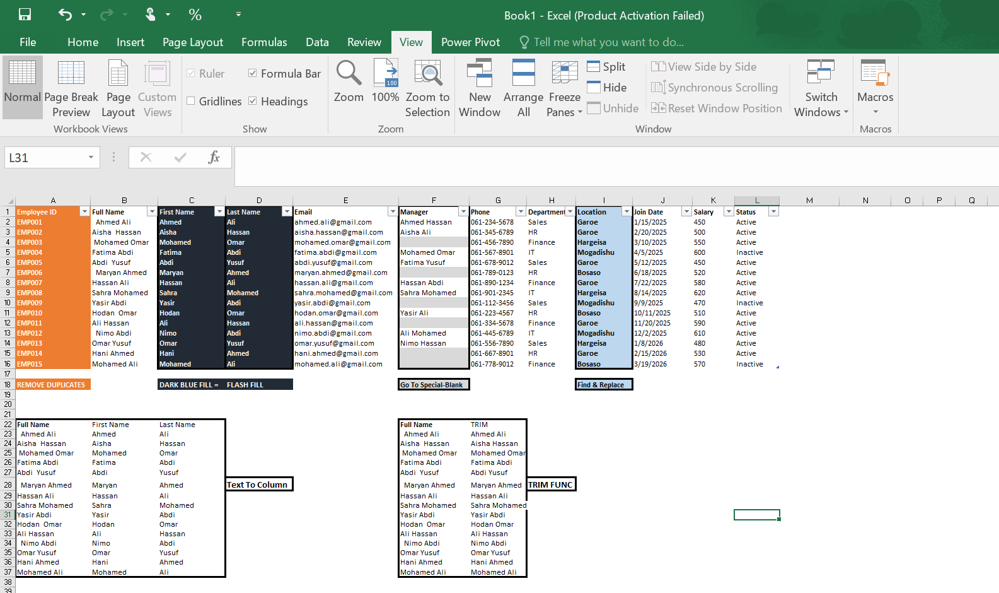

# 🧹 Excel Data Cleaning Project

## 📌 Project Overview

This project demonstrates how I used **Microsoft Excel data cleaning tools** to clean and organise an employee dataset.

The cleaning process focused on removing duplicates, separating names, standardising location values, identifying blank cells, and removing unnecessary spaces.

---

## 🎨 Colour Coding

| Colour | Represents |
|---|---|
| 🟧 Orange | Employee ID — Remove Duplicates |
| 🔵 Dark Blue | First Name & Last Name — Flash Fill |
| ◻️ Light Gray | Manager — Go To Special / Blanks |
| 🔷 Light Blue | Location — Find & Replace |
---
### Before Cleaning

The raw dataset contained:

- Duplicate employee records
- Full names stored in a single column
- Extra spaces in names
- Inconsistent location names
- Blank Manager cells

---
### After Cleaning

The dataset was transformed into a more structured and consistent format with:

- Duplicate records removed
- First and Last Names separated
- Extra spaces cleaned
- Location names standardised
- Blank Manager cells identified
- Data organised for further analysis

---

## 🎯 Key Learning Outcomes

Through this project, I practised how to:

- Identify and remove duplicate records
- Separate data into multiple columns
- Use Flash Fill to recognise data patterns
- Use Text to Columns for structured data separation
- Standardise inconsistent text using Find & Replace
- Identify blank cells using Go To Special
- Clean unnecessary spaces using TRIM
- Apply colour coding to document the cleaning process

---

### 👩‍💻 Created by

**LADAN ABDI**
