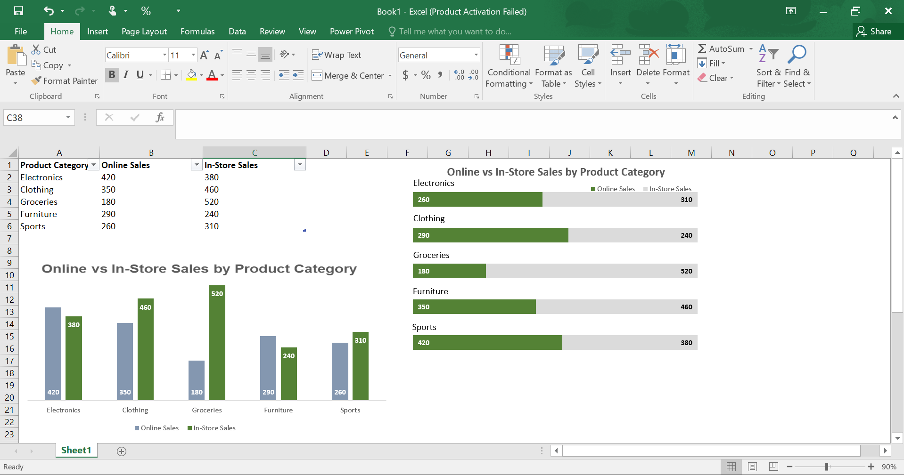
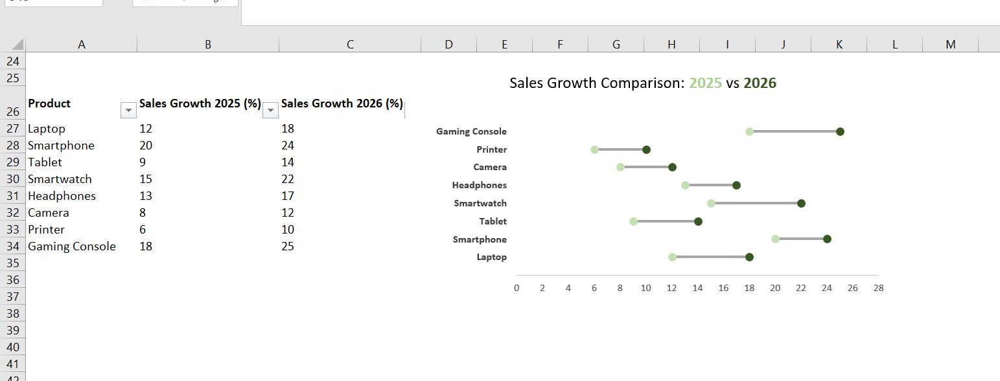

# 📊 Different-Charts

This project showcases two different Excel chart visualisations created from separate datasets. Each chart demonstrates a unique way of comparing business data, helping users identify trends, differences, and performance across categories.

---

# 📊 Chart 1: Online vs In-Store Sales by Product Category

## 📌 Description

This chart compares **Online Sales** and **In-Store Sales** for different product categories. It provides a clear visual comparison of sales performance across both sales channels.

### Key Insights

- Electronics generated higher online sales than in-store sales.
- Clothing achieved stronger in-store sales.
- Groceries recorded the highest in-store sales.
- Furniture performed better online.
- Sports products sold slightly better in-store.

### Preview

---

# 📈 Chart 2: Sales Growth Comparison (2025 vs 2026)

## 📌 Description

This comparison chart illustrates the percentage growth in sales for multiple electronic products between **2025** and **2026**, making it easy to compare year-over-year performance.

### Key Insights

- All products experienced higher growth in 2026.
- Gaming Console recorded the highest growth percentage.
- Smartphones maintained strong year-over-year performance.
- Printers showed the lowest growth values.
- Every product category demonstrated positive sales growth.

### Preview

---

# 🛠 Skills Demonstrated

- Microsoft Excel
- Data Visualisation
- Business Reporting
- Comparative Analysis
- Column Charts
- Sales Growth Analysis
- Percentage Comparison
- Chart Formatting
- Data Labelling

---

# 🎯 Project Objective

The purpose of this project is to demonstrate how different Excel chart types can effectively compare datasets, communicate business insights, and present information in a professional and easy-to-understand format.

---

## 📌 Files Included

- **Different-Charts.xlsx** – Excel workbook containing both datasets and charts.
- **README.md** – Project documentation.
- **images/** – Screenshots of the datasets and chart visualisations.

---

**Created by:** 

**Ladan Abdi**
