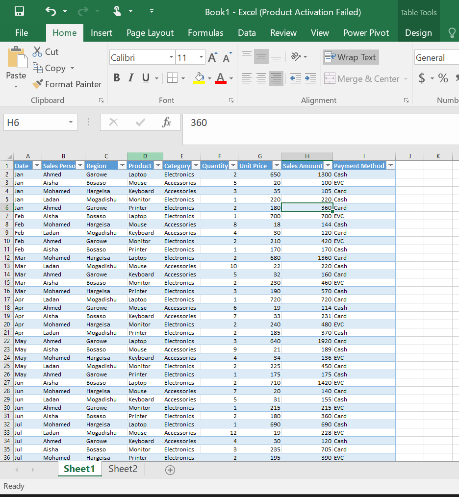
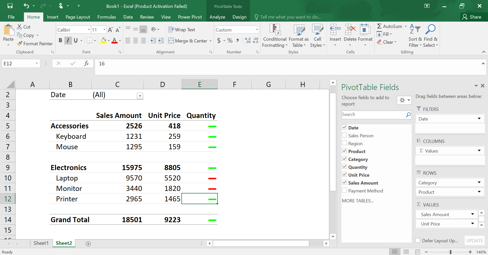
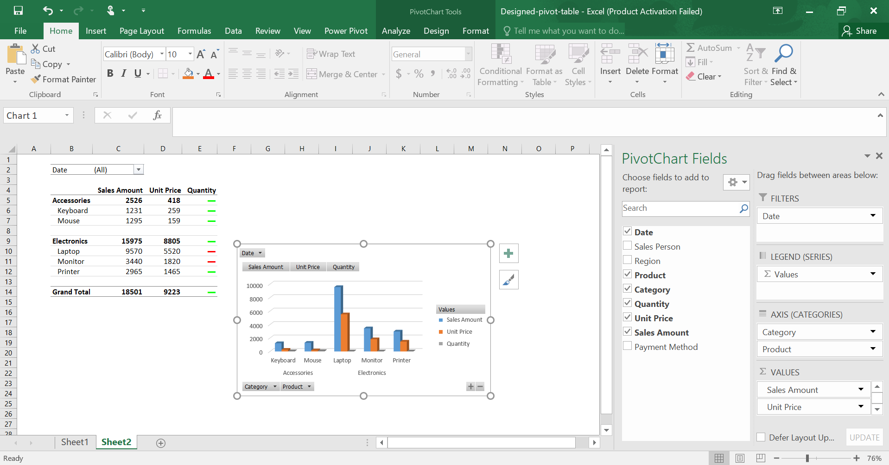

# 📊 Excel Pivot Table Design

This project demonstrates how to create a basic **Pivot Table** and **Pivot Chart** in Microsoft Excel to summarise and visualise sales data.

The Pivot Table groups products by category and displays key sales metrics, while the Pivot Chart provides a clear visual comparison.

---

# 📁 Project Structure

```
Level-up Pivot table/
│── images/
│   ├── Dataset.png
│   ├── Design-pivot-table.png
│   └── Chart.png
│
│── Designed-pivot-table.xlsx
│── README.md
```

---

# 📸 Project Preview

## Dataset



---

## Pivot Table Design



---

## Pivot Chart



---

# 🛠 Features

- Created a Pivot Table from raw sales data.
- Grouped products by category.
- Displayed total Sales Amount.
- Compared Unit Price and Quantity.
- Created a Pivot Chart for visual analysis.
- Added a Date filter for interactive reporting.

---

# 📚 Skills Practised

- Pivot Tables
- Pivot Charts
- Data Summarisation
- Data Grouping
- Data Analysis
- Excel Reporting

---

# 💡 What I Learned

During this project I learned how to:

- Create Pivot Tables.
- Organise data into categories.
- Summarise sales information quickly.
- Create Pivot Charts.
- Filter reports using Pivot Table fields.

---

# 👩‍💻 Created By

**Ladan Abdi**
