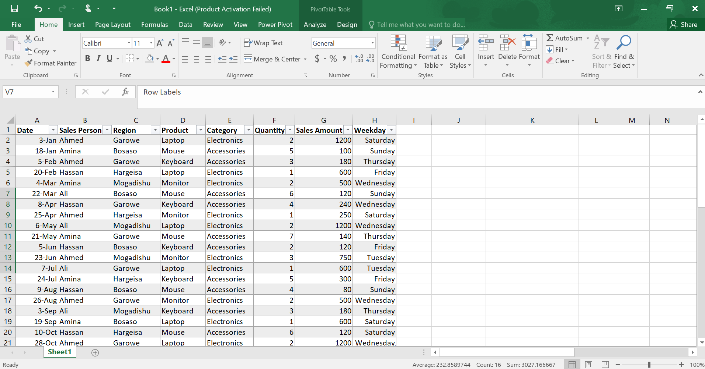
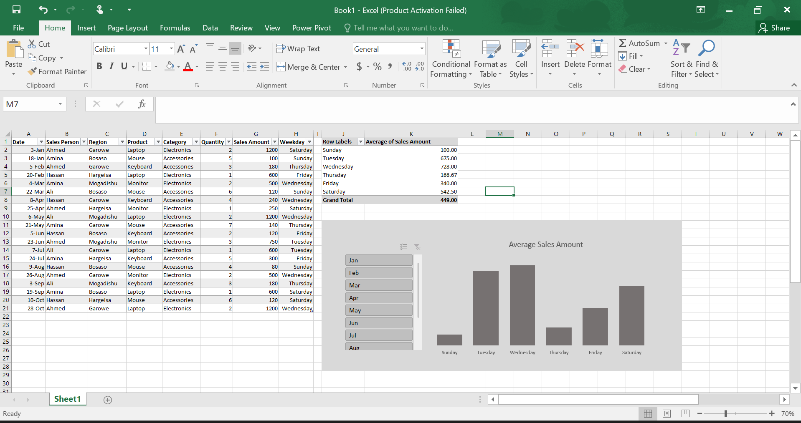
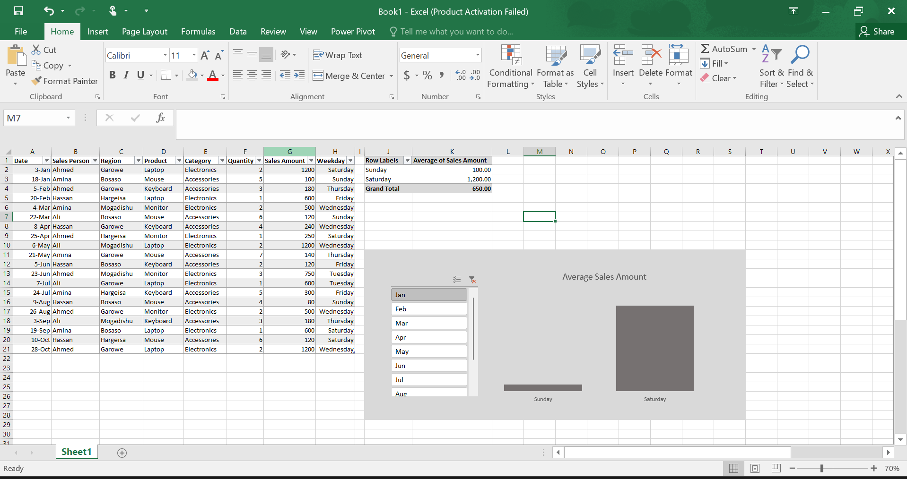

# 📊 Excel Pivot Chart with Slicers

## 📌 Project Overview

This project demonstrates how to analyse sales data using **Microsoft Excel Pivot Charts** and **Slicers**.

The dataset contains sales transactions including the sales person, region, product, category, quantity, sales amount, and weekday. A Pivot Chart was created to summarise the **Average Sales Amount by Weekday**, while Slicers allow the report to be filtered interactively by month.

---

# 🎯 Project Objectives

- Organise raw sales data into a structured table.
- Create a Pivot Chart to visualise average sales.
- Use Slicers for interactive filtering.
- Identify sales trends across different weekdays.
- Make reports easier to analyse without formulas.

---

# 📁 Dataset

The dataset contains the following columns:

| Column | Description |
|---------|-------------|
| Date | Sales transaction date |
| Sales Person | Employee responsible for the sale |
| Region | Sales location |
| Product | Product sold |
| Category | Product category |
| Quantity | Number of items sold |
| Sales Amount | Total value of the sale |
| Weekday | Day of the week calculated from the date |

### Dataset Preview

---

# 📈 Pivot Chart

A Pivot Chart was created from the dataset to display the **Average Sales Amount by Weekday**.

The chart automatically updates whenever the Pivot Table changes, making it easy to compare sales performance across different days of the week.

---

# 🎛️ Interactive Slicers

Slicers were added to make the Pivot Chart interactive.

Instead of manually filtering the Pivot Table, users can simply click a month to instantly update both the Pivot Table and Pivot Chart.

For example:

- Select **January** to display only January sales.
- Select **March** to analyse March transactions.
- Hold **Ctrl** to choose multiple months.
- Click the **Clear Filter** button to display all data again.

### Pivot Chart with Slicers

---

# 🔍 Key Insights

- Wednesday recorded one of the highest average sales amounts.
- Sunday produced the lowest average sales.
- Slicers make filtering much faster than traditional report filters.
- Pivot Charts automatically refresh when slicer selections change.
- The dashboard provides a simple way to compare weekday sales performance.

---

# 🛠️ Excel Features Used

- Pivot Table
- Pivot Chart
- Slicers
- Average Value Summary
- Interactive Filtering
- Sorting & Filtering
- Data Formatting

---

# 💡 Skills Demonstrated

- Data Cleaning
- Data Analysis
- Pivot Tables
- Pivot Charts
- Interactive Dashboards
- Data Visualisation
- Report Design

---

## 📌 Created By

**Ladan Abdi**
