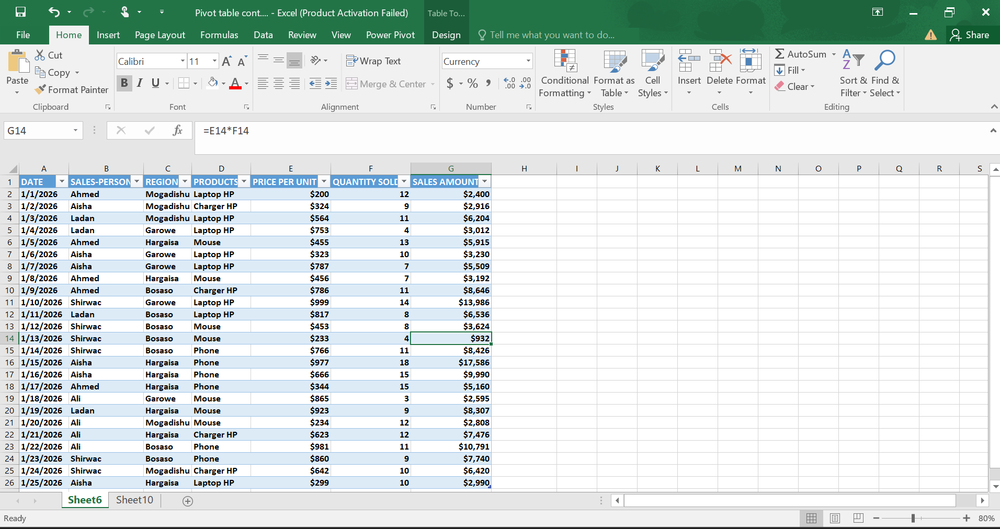
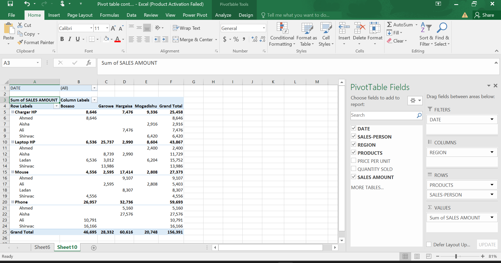
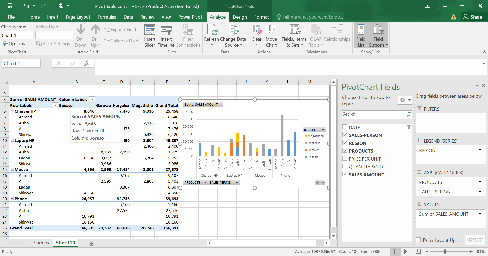
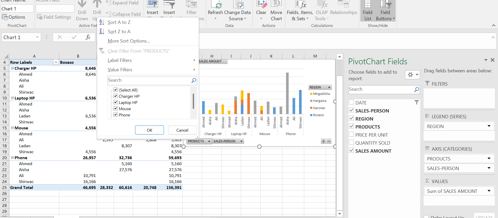
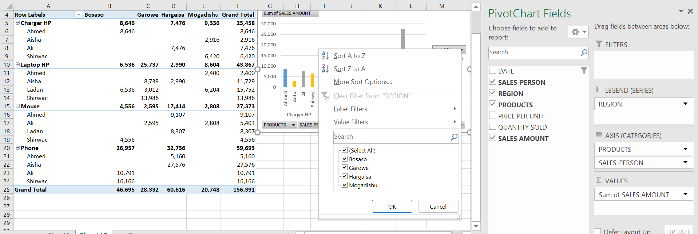
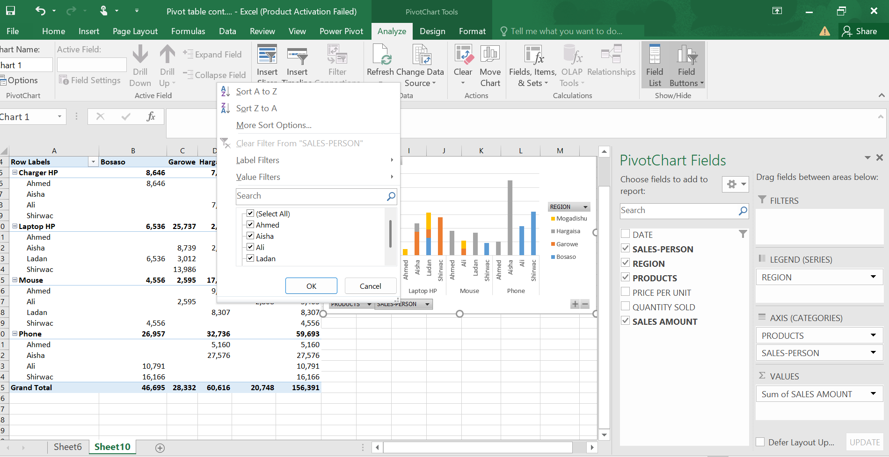
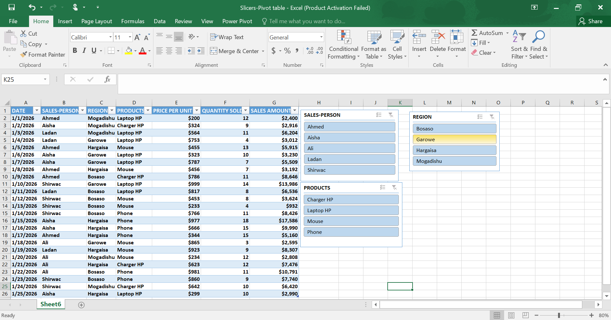

# 📊 Excel Pivot Table Analysis

This project demonstrates how to use **Microsoft Excel Pivot Tables** and **Pivot Charts** to analyse sales data.

The project summarises sales by **Product**, **Region**, and **Sales Person**, making it easier to understand business performance and compare results.

---

# 📁 Project Structure

```
Pivot-table/
│── README.md
│── images/
│   ├── Dataset.png
│   ├── Pivot-table.png
│   ├── Chart-pivot-table.png
│   ├── Product.png
│   ├── Region.png
│   └── Sales-person.png
```

---

# 🗂 Dataset

The dataset contains sales information including:

- Product
- Sales Person
- Region
- Quantity
- Price Per Unit
- Sales Amount

### Dataset Preview



---

# 📊 Pivot Table

The Pivot Table summarises the sales data by:

- Product
- Sales Person
- Region
- Total Sales Amount

This allows users to quickly compare sales performance without manually calculating totals.

### Pivot Table Preview



---

# 📈 Pivot Chart

A Pivot Chart was created from the Pivot Table to provide a visual representation of the sales data.

The chart automatically updates whenever the Pivot Table filters change.

### Pivot Chart



---

# 🎛 Interactive Filters

One of the biggest advantages of Pivot Charts is that they are interactive.

You can easily change the displayed information using the built-in field buttons.

## Change by Product

Select a different product to display its sales.



---

## Change by Region

Choose any region (Bosaso, Garowe, Hargeisa, or Mogadishu) to compare sales across locations.



---

## Change by Sales Person

You can also analyse the sales performance of individual sales people.



---

# 📌 Key Features

- Created using Microsoft Excel
- Pivot Table summarises sales data
- Pivot Chart visualises sales performance
- Interactive filters for Product, Region, and Sales Person
- Easy to explore different views of the data


# 📈 Key Insights

- Total Sales Amount: **156,391**
- Phone was the best-selling product with total sales of **59,693**.
- Hargeisa recorded the highest regional sales with **60,616**.
- Mogadishu recorded the lowest regional sales with **20,748**.
- Laptop HP was the second best-performing product with total sales of **43,867**.
- Pivot Tables make it easy to compare sales by Product, Region, and Sales Person.
- Pivot Charts allow the analysis to update instantly when filters are changed.

---

# 🎛 Interactive Slicers

To make the sales analysis more interactive, I added **Excel Slicers** connected to the Pivot Table and Pivot Chart.

Slicers provide a simple way to filter data with a single click. Instead of opening filter menus, users can instantly explore different views of the sales data.

The slicers in this project allow users to filter by:

- Product
- Region
- Sales Person

When a slicer is selected:

- The Pivot Table updates automatically.
- The Pivot Chart refreshes instantly.
- Only the selected data is displayed.

### Slicers Preview



---

# 🛠 Skills Used

- Excel Pivot Tables
- Pivot Charts
- Data Summarisation
- Data Analysis
- Filtering
- Business Reporting

---


# 👩‍💻 Created By

**Ladan Abdi**
