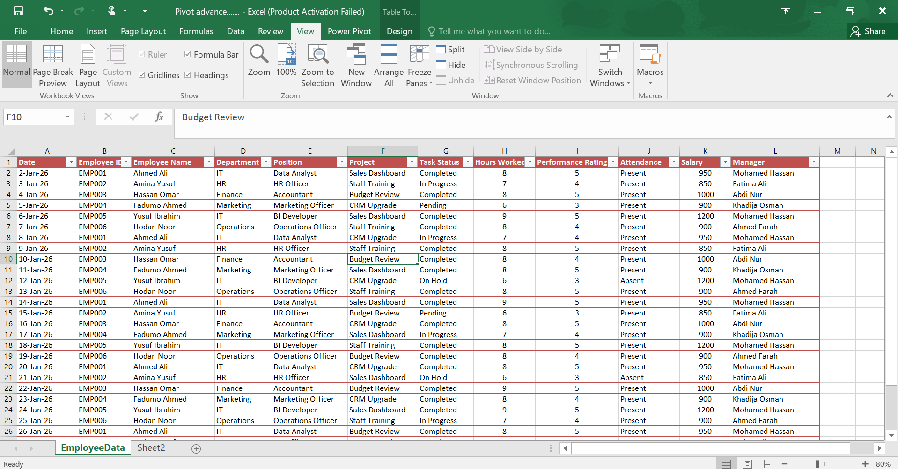
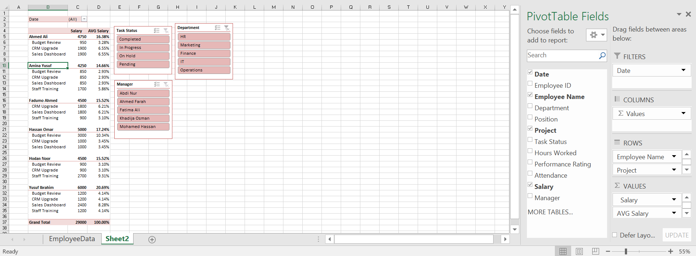

# 📸 Project Screenshots

## 📂 Dataset

The dataset contains employee records used to create the Pivot Table and interactive dashboard.

Each row represents an employee's work record and includes information such as the employee ID, employee name, department, position, project, task status, hours worked, performance rating, attendance, salary, manager, and date.

This dataset serves as the foundation for analysing employee salaries and creating interactive reports using Excel Pivot Tables, Slicers.

---

## 📊 Pivot Table Dashboard

The Pivot Table summarises employee salary data by grouping records based on **Employee Name** and **Project**.

It displays the following information:

- Total Salary for each employee.
- Salary earned from each project.
- Average Salary (%) showing each employee's contribution to the total salary.
- Grand Total of all employee salaries.

The dashboard also includes interactive controls:

- **Task Status Slicer** to filter records by task progress.
- **Department Slicer** to display specific departments.
- **Manager Slicer** to analyse employees under a selected manager.

When no slicer is applied, the Pivot Table displays the complete salary summary for all employees.

---

## 🎛️ Pivot Table with Slicer Filters

This screenshot shows the dashboard after applying filters using the slicers.

Users can select a **Department**, **Manager**, **Task Status**, **Project**, or a specific **Date** to instantly update the Pivot Table.

The dashboard automatically recalculates salary totals and displays only the matching records, making it easier to analyse employee salaries from different perspectives without changing the original dataset.

---

## 👩‍💻 Created By

**Ladan Abdi**

GitHub: https://github.com/LD2006-cloud
