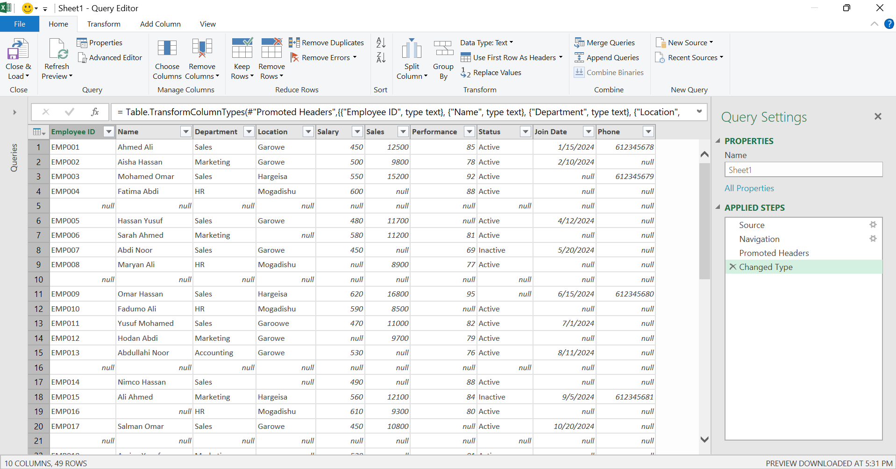
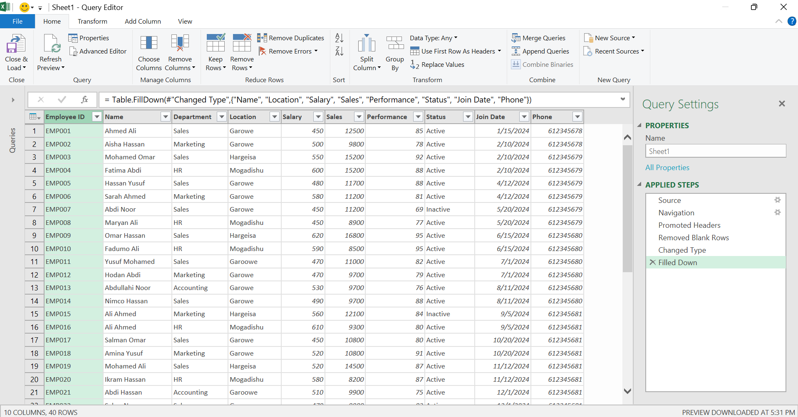
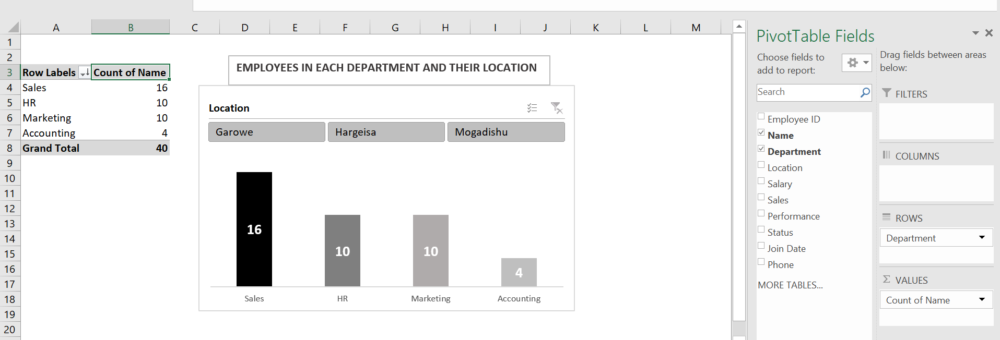

# 📊 Employee Data Cleaning with Power Query & Pivot Chart

## 📌 Project Overview

This project demonstrates how I used **Microsoft Excel Power Query** to clean, transform, and prepare an employee dataset for analysis.

The original dataset contained several data-quality issues, including:

* Blank rows
* Missing values (`null`)
* Incomplete employee records
* Inconsistent data that needed to be handled before analysis

After cleaning the dataset using **Power Query**, I created a **Pivot Chart** from the cleaned data to visualise the number of employees in each department and their locations.

The main focus of this project is learning and applying **Power Query transformations**.

---

## 🗂️ Original Dataset

The original employee dataset contained the following columns:

| Column      | Description                         |
| ----------- | ----------------------------------- |
| Employee ID | Unique identifier for each employee |
| Name        | Employee's full name                |
| Department  | Employee's department               |
| Location    | Employee's work location            |
| Salary      | Employee's salary                   |
| Sales       | Sales generated by the employee     |
| Performance | Employee performance score          |
| Status      | Employee's employment status        |
| Join Date   | Date the employee joined            |
| Phone       | Employee's phone number             |

The original dataset contained **49 rows and 10 columns**.

It also included completely blank rows and several missing values.




---

## 🧹 Power Query Data Cleaning

I imported the dataset into **Power Query Editor** to clean and transform the data before using it for analysis.




### 1. Promoted Headers

The first row of the dataset was used as the column headers.

This created proper field names such as:

* Employee ID
* Name
* Department
* Location
* Salary
* Sales
* Performance
* Status
* Join Date
* Phone

---

### 2. Changed Data Types

I used the **Changed Type** step to assign appropriate data types to the columns.

For example:

* Name → Text
* Department → Text
* Location → Text
* Salary → Number
* Sales → Number
* Performance → Number
* Status → Text
* Join Date → Date
* Phone → Number

Using the correct data types is important because Power Query needs to understand what type of data each column contains.

For example, **Salary** and **Sales** should be numerical values so that they can later be used for calculations and analysis.

---

### 3. Removed Blank Rows

The original dataset contained completely blank rows between employee records.

I removed these blank rows using Power Query's **Remove Blank Rows** functionality.

This reduced the dataset from **49 rows to 40 rows**.

Removing completely blank rows makes the dataset cleaner and easier to analyse.

---

### 4. Filled Down Missing Values

I also used the **Fill Down** transformation on selected columns.

The Fill Down operation takes a value from the row above and places it into the blank cell below it.

For example:

```text
Before:

Location
Garowe
null
null
Mogadishu

After Fill Down:

Location
Garowe
Garowe
Garowe
Mogadishu
```

This can be useful when a blank cell means that the value should continue from the previous record.

**Important:** Fill Down should only be used when the missing value is logically supposed to inherit the value above it. It should not be used blindly to replace genuinely unknown data.

---

## 🔄 Power Query Applied Steps

The main transformation steps in this project were:

1. **Source** – Connected to the original Excel dataset.
2. **Navigation** – Selected the required worksheet/table.
3. **Promoted Headers** – Converted the first row into column headers.
4. **Changed Type** – Assigned appropriate data types to each column.
5. **Removed Blank Rows** – Removed completely empty rows.
6. **Filled Down** – Filled selected missing values using the value from the previous row.

These steps created a cleaner and more structured dataset that could be used for further analysis.

---

## 📈 Cleaned Dataset

After the Power Query transformations, the dataset contained:

* **40 employee records**
* **10 columns**
* Proper column headers
* Correct data types
* No completely blank rows
* Filled values where appropriate

The cleaned data was then loaded back into Excel for analysis.

---

## 📊 Pivot Chart

After completing the Power Query cleaning process, I used the cleaned dataset to create a **Pivot Chart**.

The chart focuses on:

> **Employees in Each Department and Their Location**

This allows me to compare how employees are distributed across different departments and locations.

For example, I can analyse:

* How many employees are in each department
* Which locations have more employees
* How departments are distributed across locations

The Pivot Chart was created using the cleaned data produced by Power Query.



---

## 🎛️ Slicer

I also added a **Slicer** to make the Pivot Chart interactive.

The slicer allows me to filter the chart based on the selected category, making it easier to explore the employee data without manually changing the Pivot Table filters.

For example, selecting a particular department or location updates the visualisation to show only the relevant employees.

---

## 🔗 Power Query → Pivot Chart Workflow

The overall workflow of this project was:

```text
Original Employee Dataset
          ↓
      Power Query
          ↓
    Promote Headers
          ↓
      Change Types
          ↓
   Remove Blank Rows
          ↓
      Fill Down
          ↓
    Cleaned Dataset
          ↓
      Pivot Table
          ↓
      Pivot Chart
          ↓
        Slicer
```

This demonstrates an important data-analysis workflow:

**Clean → Transform → Analyse → Visualise**

---

## 🎯 Key Learning Outcomes

Through this project, I practised how to:

* Import data into Power Query
* Understand the Power Query Editor
* Promote the first row to headers
* Change column data types
* Remove completely blank rows
* Handle missing values using Fill Down
* Understand Applied Steps
* Load cleaned data back into Excel
* Create a Pivot Table from cleaned data
* Create a Pivot Chart
* Add a Slicer for interactive filtering

---

## 🛠️ Tools Used

* **Microsoft Excel**
* **Power Query**
* **Pivot Tables**
* **Pivot Charts**
* **Slicers**

---

## 📌 Conclusion

This project helped me understand that **data cleaning should come before data analysis**.

Power Query made it possible to clean and transform the original employee dataset in a structured and repeatable way. Once the data was cleaned, I used it to create a Pivot Chart and Slicer for easier analysis.

The main purpose of this project was to practise **Power Query data transformation**, while the Pivot Chart was used as a simple way to demonstrate how cleaned data can be turned into useful insights.

