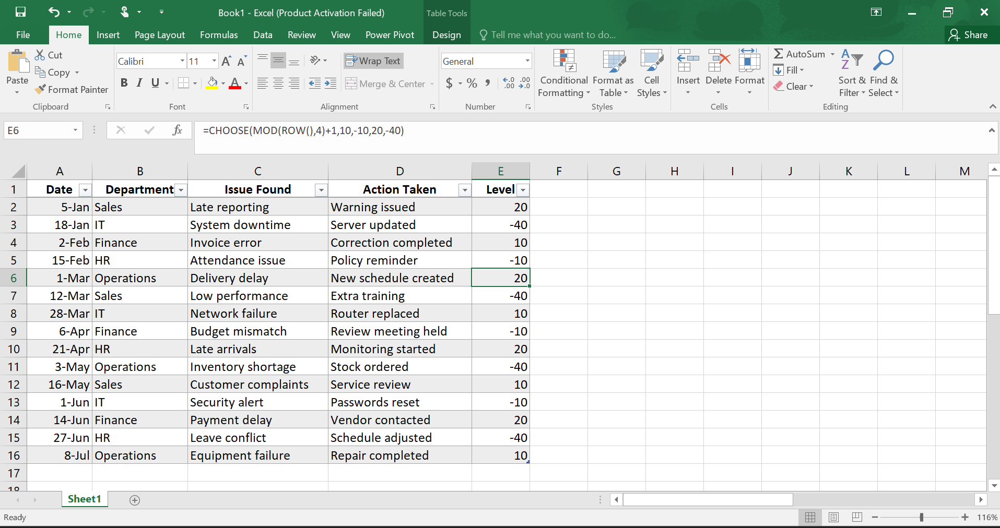
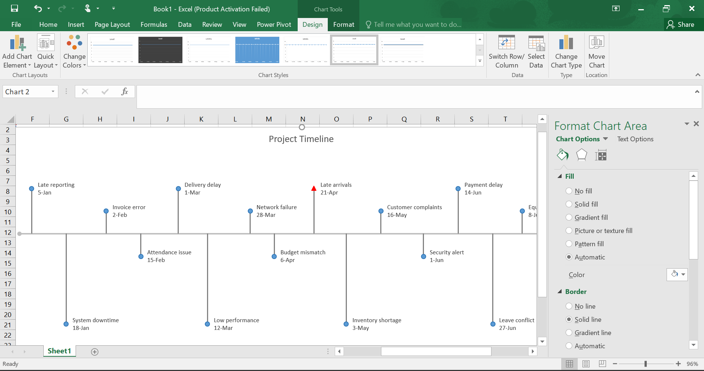
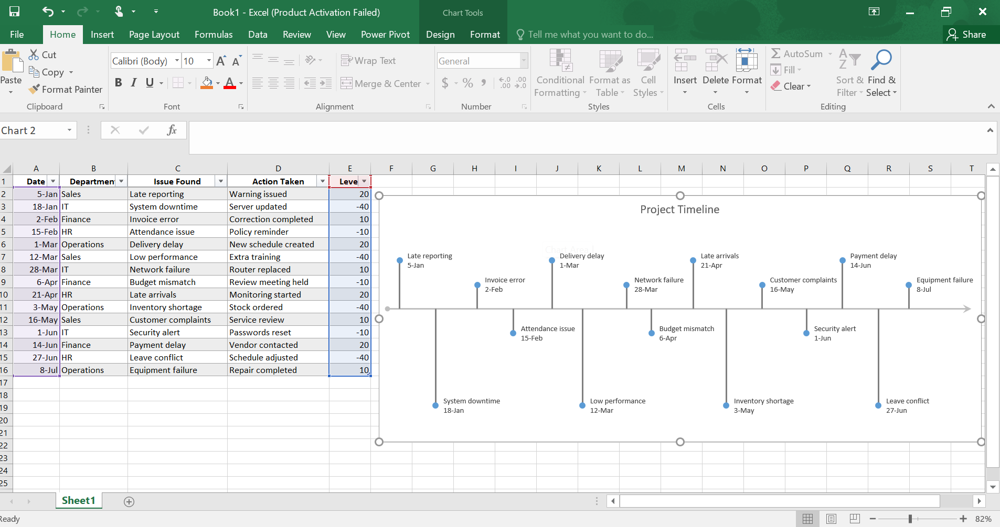

# 📅 Excel Project Timeline

## 📌 Project Overview

This project demonstrates how to create a **visual project timeline using Microsoft Excel**.

The purpose of this project is to organise meeting records and display events in chronological order. The timeline helps users track important activities, monitor issues, review actions taken, and highlight key dates or milestones.

---

# 🎯 Project Objectives

The main objectives of this project are:

- Create a structured timeline from meeting data.
- Visualise events based on dates.
- Highlight important dates and milestones.
- Improve tracking and reporting of activities.
- Present information in a clear and organised format.

---

# 🛠 Tools & Skills Used

- Microsoft Excel
- Timeline Visualization
- Data Formatting
- Date Management
- Data Visualization

---

# 📷 Project Screenshots

## 1. Dataset

This screenshot shows the original dataset used to create the Excel timeline. It contains meeting records including dates, departments, issues found, actions taken, and impact levels.

---

## 2. Important Dates Highlighting

This screenshot demonstrates how important dates or milestones can be highlighted using different colours. This helps users quickly identify key meetings, deadlines, or important events within the timeline.

---

## 3. Project Timeline

This screenshot shows the final Excel timeline visualization created in Microsoft Excel. It presents events in chronological order and provides a clear overview of activities, issues, and important milestones throughout the project period.

---

# 🔍 Key Insights

- Timeline visualization improves understanding of events over time.
- Important dates can be emphasised to draw attention to critical activities.
- Meeting records become easier to review and communicate.
- Visual timelines support better planning and decision-making.

---

# ✅ Conclusion

This project demonstrates how Microsoft Excel can be used to transform structured meeting data into a professional timeline visualization.

By organising dates, tracking events, and highlighting important milestones, timelines provide a simple and effective way to monitor progress and communicate information.

---

Created by **Ladan Abdi**
