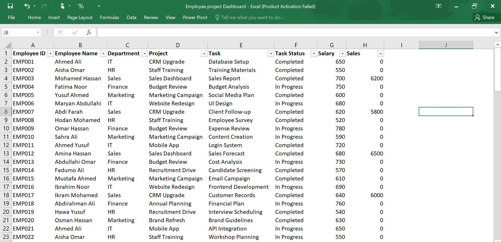
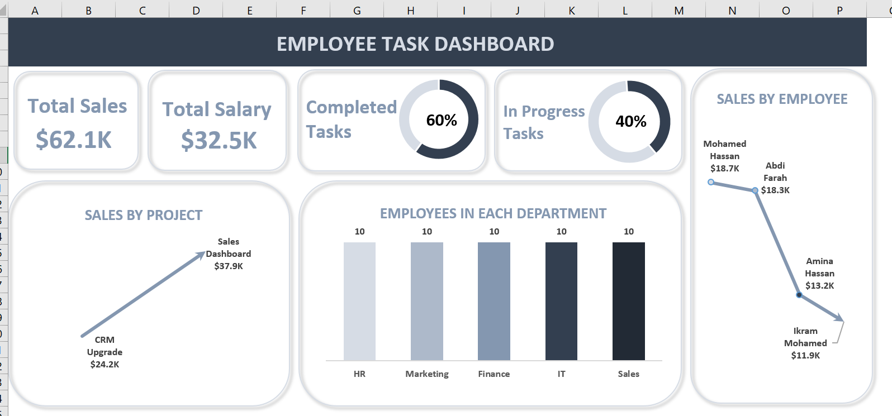

# 📊 Employee Task Dashboard – Microsoft Excel

## 📌 Project Overview

This project demonstrates how I created an **Employee Task Dashboard using Microsoft Excel** to analyse employee sales, salaries, task status, projects, and department distribution.

The dashboard provides a simple visual overview of employee and project performance using KPIs and charts.

---

## 📂 Dataset Overview

The dataset contains employee-level information that can be used to analyse **sales performance, salary costs, task progress, projects, and departments**.

Each row represents an employee and includes the following information:

| Column          | Description                         |
| --------------- | ----------------------------------- |
| **Employee**    | Name of the employee                |
| **Department**  | Department where the employee works |
| **Project**     | Project assigned to the employee    |
| **Salary**      | Salary paid to the employee         |
| **Sales**       | Sales generated by the employee     |
| **Task Status** | Current status of the assigned task |

### 🎯 Business Questions

The dataset was created to answer questions such as:

* What are the total sales generated by employees?
* What is the total salary cost?
* What percentage of tasks are completed?
* What percentage of tasks are still in progress?
* Which employees generate the highest sales?
* Which project generates the most sales?
* How many employees are in each department?

---

## 📊 Dashboard

---

## 🔍 Key Insights

* **Total Sales:** $62.1K
* **Total Salary:** $32.5K
* **Completed Tasks:** 60%
* **In Progress Tasks:** 40%
* **Highest Sales Project:** Sales Dashboard — $37.9K
* **Highest Sales Employee:** Mohammed Hassan — $18.7K
* **Employees per Department:** 10

---

## 🛠️ Tools & Skills

* Microsoft Excel
* Data Cleaning
* Excel Formulas
* KPI Cards
* Pivot Tables
* Data Visualisation
* Dashboard Design
* Charts & Formatting

---

---

## 👩‍💻 Created By

**Ladan Abdi**

