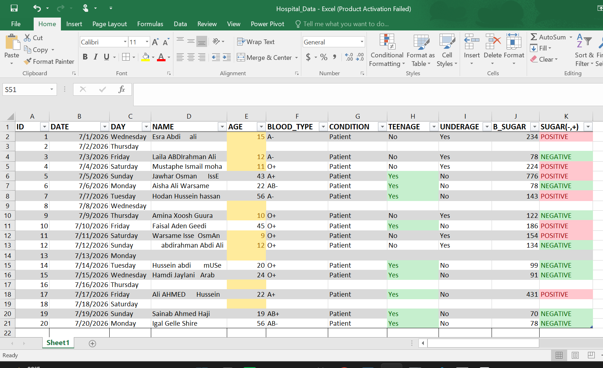
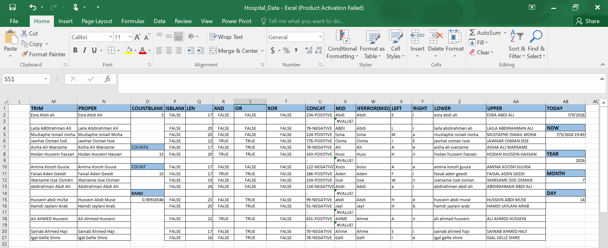
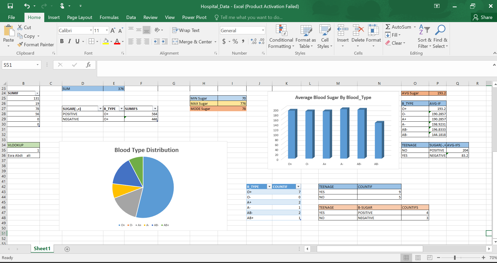

# 🏥 Hospital Patient Analysis

## 📌 Project Overview

This project was created in Microsoft Excel to practise data cleaning, Excel formulas, and data analysis using a hospital patient dataset.

---

## 📂 Dataset

The dataset contains patient information such as:

- ID
- Date
- Day
- Patient Name
- Age
- Blood Type
- Condition
- Teenage Status
- Underage Status
- Blood Sugar Level
- Sugar Status (Positive / Negative)

### Dataset Preview

---

## 🛠 Excel Functions Used

The following Excel functions were used:

### Text Functions
- TRIM
- PROPER
- LEN
- CONCAT
- LEFT
- RIGHT
- MID
- LOWER
- UPPER

### Logical Functions
- IF
- IFS
- IFERROR
- AND
- OR
- XOR

### Information Functions
- ISBLANK

### Counting Functions
- COUNT
- COUNTIF
- COUNTIFS
- COUNTA
- COUNTBLANK

### Date & Time Functions
- TODAY
- NOW
- YEAR
- MONTH
- DAY

### Random Function
- RAND

### Functions Screenshot

---

## 📊 Project Summary

This project helped me practise:

- Data Cleaning
- Excel Functions
- Basic Data Analysis

### Summary Screenshot

---

## 🎯 Skills Demonstrated

- Microsoft Excel
- Data Cleaning
- Data Analysis
- Excel Functions
- Documentation

---

Created by **Ladan Abdi**
