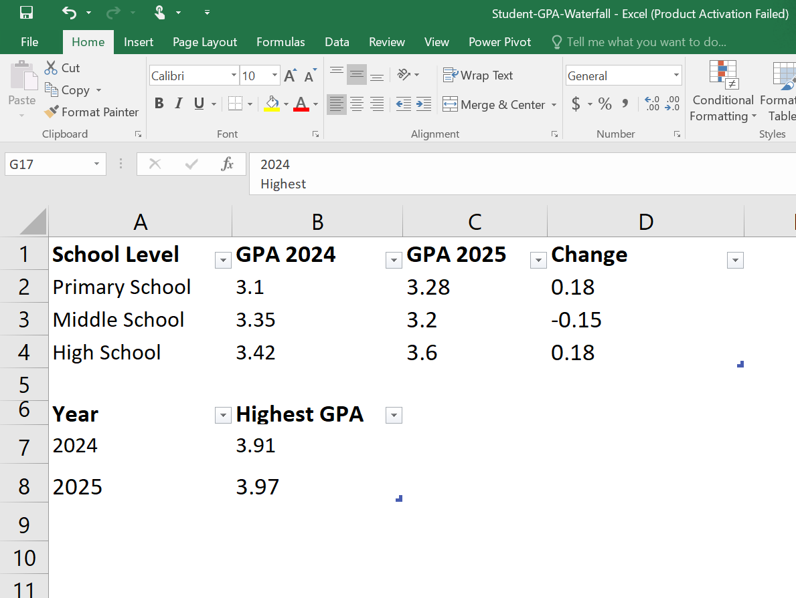
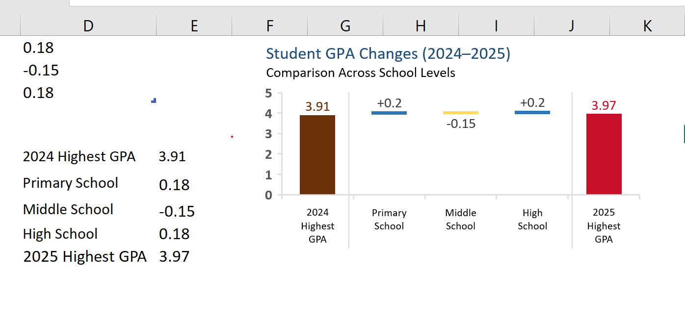

# 📊 Student GPA Waterfall Chart

## 📌 Project Overview

This project demonstrates how to create a **Waterfall Chart in Microsoft Excel** to analyse changes in student GPA between **2024 and 2025**.

The dataset compares the average GPA across three school levels: **Primary School**, **Middle School**, and **High School**. The chart highlights both positive and negative changes, making it easy to understand how each school level contributed to the overall improvement in the highest student GPA.

---

## 🎯 Project Objectives

- Create a structured dataset for GPA analysis.
- Compare GPA performance between 2024 and 2025.
- Visualise GPA increases and decreases using a Waterfall Chart.
- Identify how each school level contributed to the overall GPA change.
- Present the highest GPA achieved in each academic year.

---

## 📂 Dataset

The dataset contains the following information:

| Column | Description |
|--------|-------------|
| **School Level** | The education level (Primary, Middle, and High School). |
| **GPA 2024** | The average GPA recorded in 2024. |
| **GPA 2025** | The average GPA recorded in 2025. |
| **Change** | The difference between the 2024 and 2025 GPA values. Positive values indicate improvement, while negative values indicate a decline. |

### Dataset Preview

---

## 📈 Waterfall Chart

The Waterfall Chart begins with the **highest GPA recorded in 2024 (3.91)** and ends with the **highest GPA recorded in 2025 (3.97)**.

Between these two values, the chart displays how each school level affected the overall result:

- **Primary School** increased by **0.18 GPA points**.
- **Middle School** decreased by **0.15 GPA points**.
- **High School** increased by **0.18 GPA points**.

This visualisation makes it easy to understand which school levels contributed positively or negatively to the overall GPA change.

### Waterfall Chart

---

## 📊 Key Insights

- The highest GPA increased from **3.91** in **2024** to **3.97** in **2025**.
- Primary School recorded a positive GPA improvement.
- Middle School experienced a slight decline in GPA.
- High School showed a positive improvement.
- The overall GPA performance improved between the two academic years.

---

## 🛠️ Tools Used

- Microsoft Excel
- Waterfall Chart
- Basic Data Analysis

---

**Created by Ladan Abdi**
